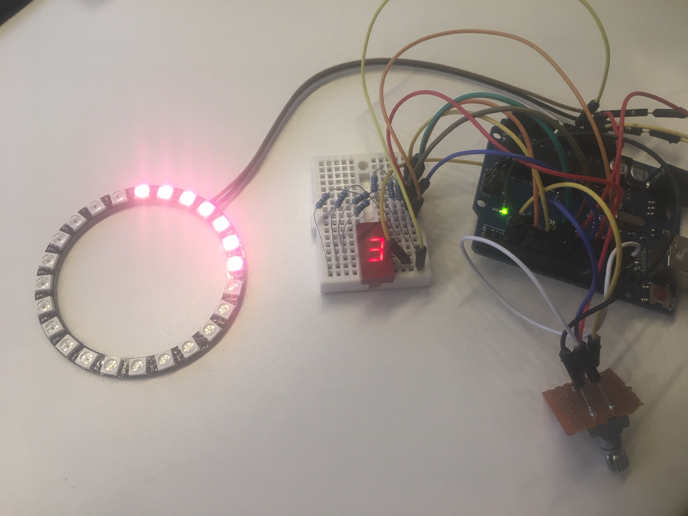
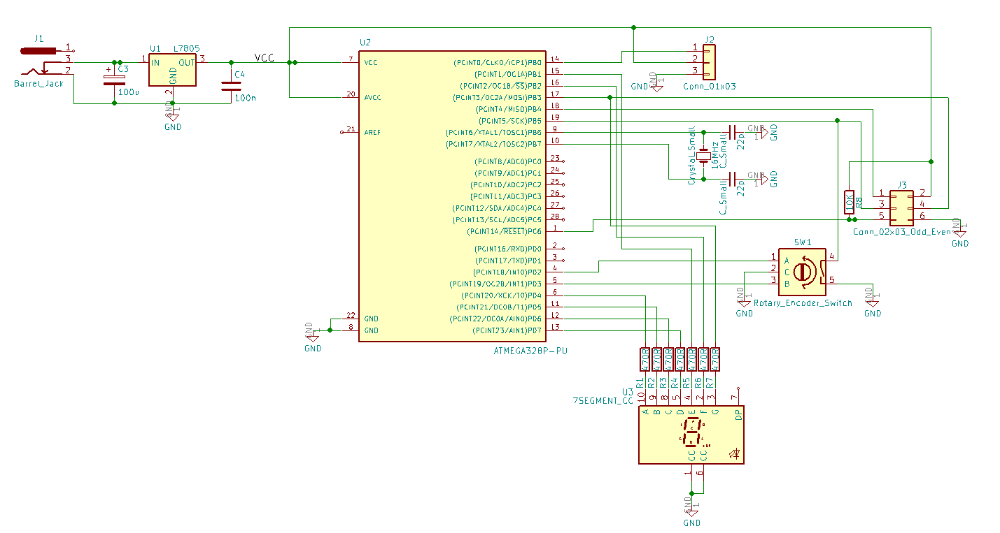

# Arduino-Macro-Ring

This project is for a RGB LED ring for macro photography or microscopes, to reduce shadows and reflections in the image.

The LED’s are controlled by a rotary switch that selects between different modes of brightness, colour and number of LED’s lit.  
Modes:

0. Set brightness, default full brightness with white light
1. Set Colour
- White
- Warm white
- Cool white
- Blue
- Red
- Green
- Random
2. Set number of LED's
3. Rotate number of LED's
4. Two opposite LED's
5. Four opposite LED's

## Hardware

- The project contains 3D model for a small enclosure for the electronics, and an arm intended for mounting on a microscope.
- It uses a WS2812B Module Strip from [Aliexpress](https://www.aliexpress.com/item/WS2812B-Module-Strip-24-Bits-24-X-WS2812-5050-RGB-LED-Ring-Lamp-Light-with-Integrated/32842513885.html?spm=a2g0s.9042311.0.0.27424c4dtHlEIW)
- The LED strip is controlled using a Arduino Nano microcontroller. 
- The mode selection is shown on a 7-segment display.

## Software

The software is written in C and relies on the Adafruit NeoPixel library.
New modes of operation can easily be added to the program.

## Circuit diagram

## Licence

2019 MIT
